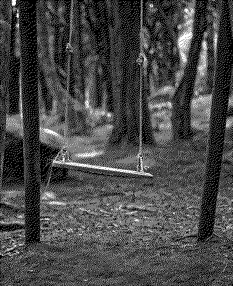
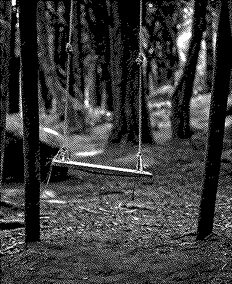
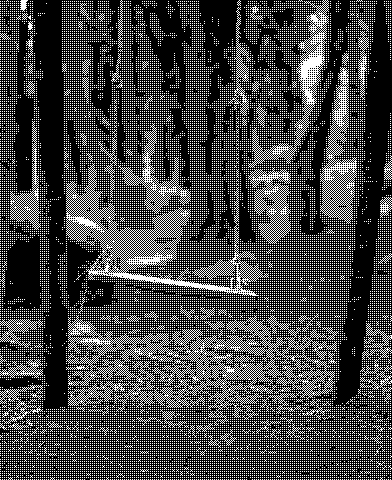
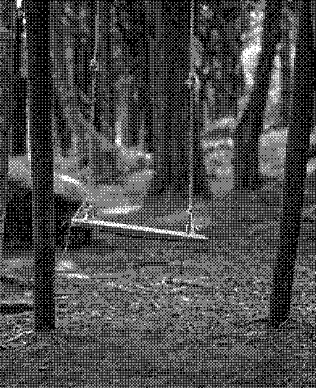
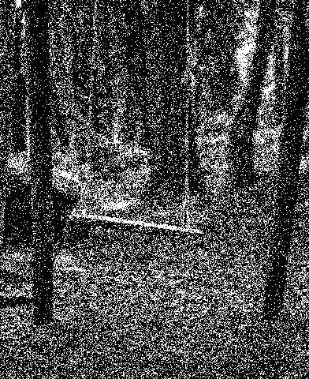
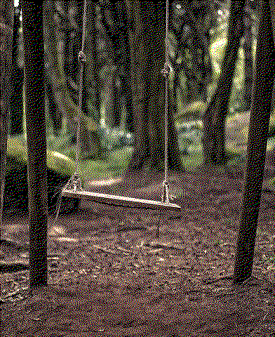
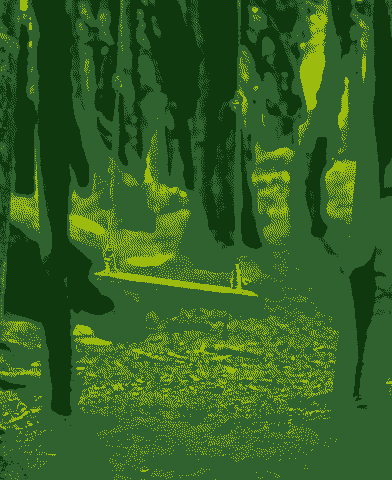
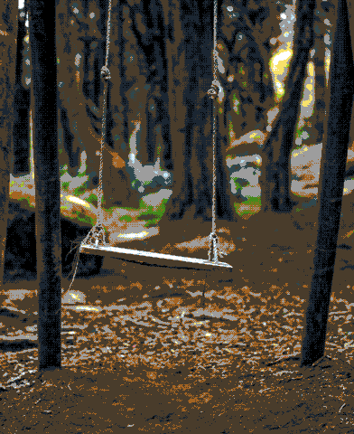

<p align="center">
    <br>
    
    <br>
<p>


[](https://pypi.org/project/dithering/)

Fast image dithering for Python, written in Rust. One call, sane defaults, every classic algorithm:

- **Error diffusion** — Floyd–Steinberg, Jarvis–Judice–Ninke, Stucki, Atkinson, Burkes, Sierra, Two-Row Sierra, Sierra Lite, False Floyd–Steinberg — with optional serpentine scanning.
- **Ordered (Bayer)** — 2×2 to 16×16 generated matrices, or bring your own threshold matrix.
- **Random (white noise)** — seedable.
- **Palettes** — dither straight to any color set (`["#0f380f", "#306230", ...]`), not just black & white.
- **Multi-level** — quantize to N gray/color levels per channel, not just 2.
- **Gamma-correct mode** — `linear=True` does the math in linear light and preserves perceived brightness (most libraries get this wrong).
- **Ergonomics** — numpy in → numpy out, PIL in → PIL out, alpha channels preserved, forgiving names (`"fs"`, `"Floyd-Steinberg"`, `"BAYER8X8"` all work, and `ordered_dither` takes the matrix size as an int), typed stubs, helpful error messages.
- **Fast** — the hot loops release the GIL; ~550 MP/s ordered and ~120 MP/s Floyd–Steinberg on an M-series laptop.

## Installation

```bash
pip install dithering
```

Wheels are published for Linux (glibc + musl), macOS and Windows — one abi3 wheel per platform covers CPython 3.9 and everything newer. PyPy installs from the source distribution (needs a Rust toolchain).

## Quickstart

```python
from PIL import Image
import dithering

img = Image.open("photo.jpg")

# Classic black & white Floyd-Steinberg (the default):
bw = dithering.dither(img)

# Ordered dithering with an 8x8 Bayer matrix:
retro = dithering.dither(img, "bayer8x8")

# Dither to a Game Boy palette:
gameboy = dithering.dither(img, "atkinson", palette=["#0f380f", "#306230", "#8bac0f", "#9bbc0f"])

gameboy.save("gameboy.png")
```

Everything also works directly on numpy arrays (2-D grayscale or H×W×C uint8), and returns arrays in that case:

```python
import numpy as np
import dithering

arr = np.asarray(Image.open("photo.jpg"))
out = dithering.error_diffusion(arr, "stucki", serpentine=True, levels=4)
```

## Gallery

| Original | Floyd–Steinberg | Atkinson |
| --- | --- | --- |
|  |  |  |

| Bayer 2×2 | Bayer 8×8 | Random |
| --- | --- | --- |
|  |  |  |

| RGB Floyd–Steinberg | Game Boy palette | 16-color palette, Bayer 8×8 |
| --- | --- | --- |
|  |  |  |

## API

The one-stop entry point dispatches on the method name:

```python
dithering.dither(image, method="floyd_steinberg", *, levels=2, palette=None,
                 serpentine=False, seed=None, strength=1.0, linear=False,
                 preserve_alpha=True)
```

Or call the specific functions — same parameters, minus the ones that don't apply:

| Function | Methods |
| --- | --- |
| `error_diffusion(image, method, ...)` | `floyd_steinberg` (alias `fs`), `false_floyd_steinberg` (`ffs`), `jarvis_judice_ninke` (`jjn`), `stucki`, `atkinson`, `burkes`, `sierra` (`sierra3`), `sierra_two_row` (`sierra2`), `sierra_lite` |
| `ordered_dither(image, matrix, ...)` | `bayer2x2` … `bayer16x16`, the size as an int (`8`), or a custom 2-D numpy matrix (integer dtype = Bayer-style indices, float dtype = thresholds in `[0, 1]`) |
| `random_dither(image, ...)` | white noise; pass `seed=` for reproducible output |

All names are case-insensitive and `-`/`_` are interchangeable. `available_methods()` and `available_matrices()` list the valid names at runtime.

**Common parameters**

| Parameter | Default | Meaning |
| --- | --- | --- |
| `levels` | `2` | Output levels per channel. `2` = black & white; `4` gives 0/85/170/255, etc. |
| `palette` | `None` | Dither to these exact colors instead of gray levels. Hex strings (`"#fff"`, `"#0f380f"`) or `(r, g, b)` tuples. Needs an RGB(A) image. |
| `serpentine` | `False` | (Error diffusion) alternate the scan direction each row; reduces directional "worm" artifacts. |
| `strength` | `1.0` | `0.0` = plain quantization, `1.0` = full dithering. |
| `linear` | `False` | Do the math in linear light (gamma-correct). sRGB 50 % gray is only ~21 % linear light — with `linear=True` the dithered result keeps the *perceived* brightness of the original instead of coming out too bright. |
| `preserve_alpha` | `True` | For LA/RGBA inputs, pass the alpha channel through untouched instead of dithering it. |

**Input/output contract**

- Accepts uint8 numpy arrays — 2-D grayscale or 3-D (H, W, C) — and PIL images (any mode; exotic modes are converted to RGB first).
- Returns a new uint8 array of the same shape, or a PIL image if you passed one. The input is never modified.
- Float arrays are rejected with a hint (`(img * 255).clip(0, 255).astype(np.uint8)`), invalid names raise `ValueError` listing the valid ones.

## Performance

2048×2048 grayscale (4.2 MP) on an Apple M-series laptop:

| Operation | Time | Throughput |
| --- | --- | --- |
| `ordered_dither`, Bayer 8×8 | ~8 ms | ~550 MP/s |
| `random_dither` | ~7 ms | ~570 MP/s |
| `error_diffusion`, Floyd–Steinberg | ~34 ms | ~120 MP/s |
| `error_diffusion`, Stucki + serpentine | ~38 ms | ~110 MP/s |
| Pillow `convert("1")` (Floyd–Steinberg, the only dither it has) | ~18 ms | ~240 MP/s |

Pillow's single hard-coded binary-grayscale Floyd–Steinberg loop is still faster than our general engine — but it can't do other kernels, serpentine, levels, palettes, strength or linear light. Pure-Python libraries are typically 100–1000× slower. The hot loops release the GIL, so other Python threads keep running.

## Correctness notes

- Bayer thresholds use the mean-preserving `(index + 0.5) / n²` convention: a 50 % gray dithers to exactly 50 % white pixels, solid black stays black, solid white stays white.
- Error-diffusion kernels are the canonical published coefficients; error falling off the image edge is discarded.
- Atkinson intentionally diffuses only 6/8 of the error — deep shadows and highlights clip to solid black/white. That's the classic Mac look, not a bug.
- The test suite (44 Rust + 82 Python tests) asserts mean preservation, palette exactness, alpha preservation and reproducibility for every algorithm.

## Development

```bash
cargo test                                    # Rust unit tests
maturin develop --release                     # build into the active venv
pytest tests/ -v                              # Python end-to-end tests
```

## Contributing

Contributions are welcome! Fork the repository, create a branch from `main`, make your changes (please add tests), and open a pull request.

## License

MIT — see [LICENSE](https://github.com/BackyardML/dithering/blob/main/LICENSE).

## Contact

Questions, suggestions, feedback: open an issue on GitHub or email [info@backyardml.se](mailto:info@backyardml.se).
